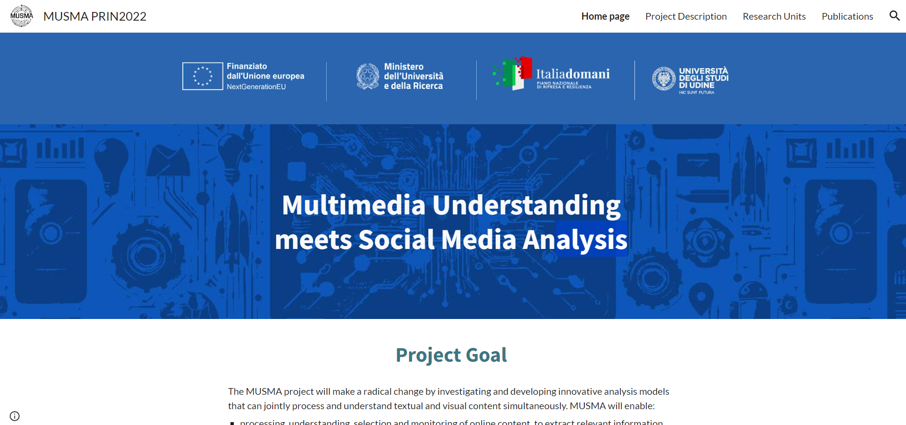
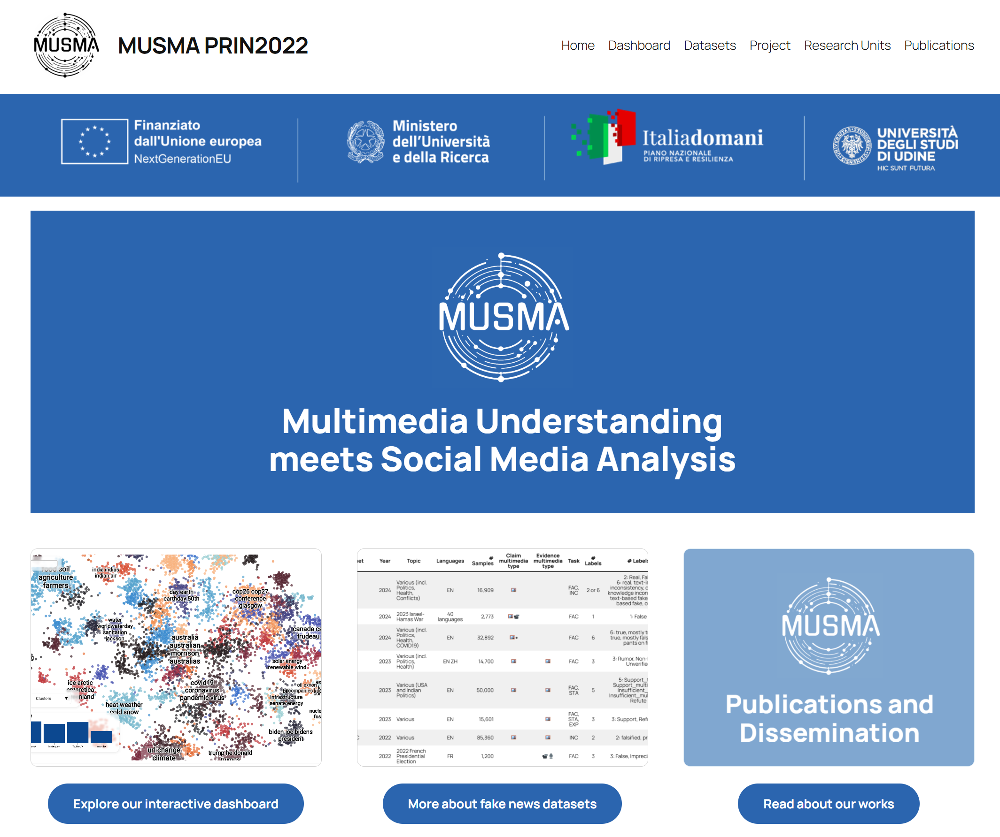
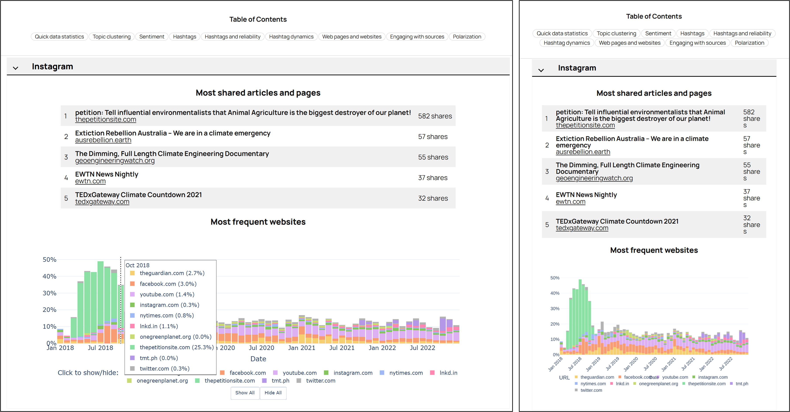
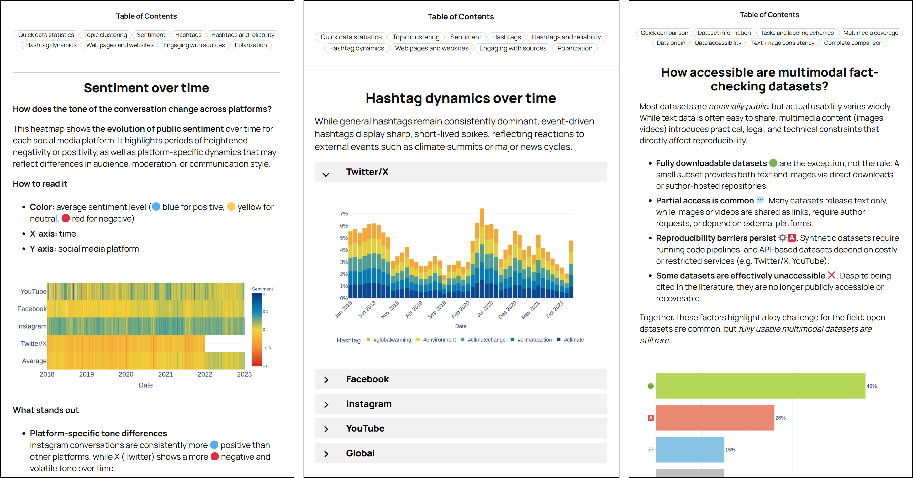
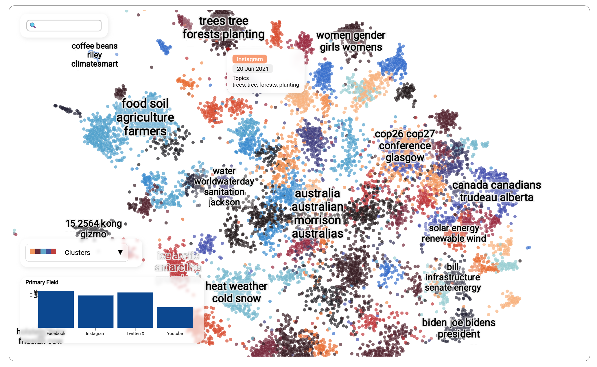

Website for project MUSMA: Multimedia Understanding meets Social Media Analysis.
{style="color: gray; font-size: smaller;"}

<!--more-->

**<mark>Website</mark>** · [https://musma.uniud.it/](https://musma.uniud.it/)  
**<mark>Website</mark>** · (former) [https://sites.google.com/view/musma](https://sites.google.com/view/musma)  
**<mark>Tools</mark>**
· **wordpress**
· **html**
· **css**
· **plotly**
· **python**

I'm one of the researchers involved in MUSMA, a project involving the University of Udine, University of Modena and Reggio Emilia, and the University of Rome "La Sapienza". Its objective is developing new technologies for analyzing multimedia content on social media, how (mis)information spreads through the content, and how people react to it.

<!--  -->

I initially designed a simple clean site on google sites, shared with the other collaborators, to keep track of the objectives and [achievements](https://sites.google.com/view/musma/publications) of the project.

I then migrated the website to WordPress for greater flexibility, planned the new layout, and created the various visualizations for the results of the project.

The biggest challenge was the [Dashboard](https://musma.uniud.it/dashboard/) page, showcasing the results of various AI models in an understantable way, with interactive plots and short paragraphs summarizing the main insights. I took particular care in trying to make the website accessible to both desktop and mobile users. Most of the plots are interactive on desktop, but become static and legible images on mobile (or if you shrink the window enough, see image below).

Most of the data visualizaitons were created using the Plotly python library. I learnt a lot about creating nice-looking and readable interactive plots!

The most challenging one to create was the topic cluster (created with datamapplot), which allows you to visualize the topic distribution of thousands of twitter, instagram, and facebook posts and how they relate to each other. You can filter the visualization according to keywords or social media, and change the coloring scheme to reflect topics, social media, or creation date.

